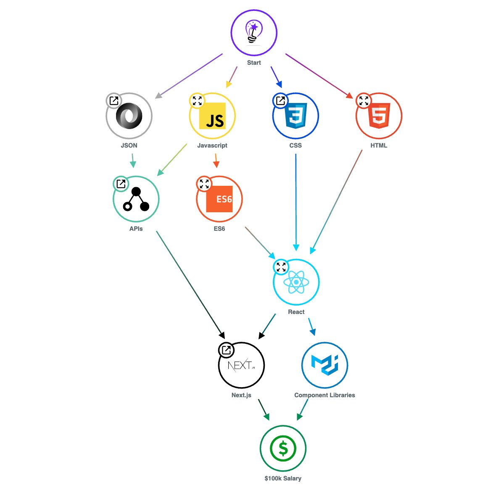

## 簡報大綱：全端開發入門

> 流程設計：先建立「角色認知」→ 再談「學習方向」→ 最後進入「後端原理科普」
> 由淺入深，從是什麼、為什麼，到怎麼運作。

---

# 第一部分：認識角色

### 1. 封面

主標：**踏入全端世界 — 從零認識前端、後端與資料庫**
副標：在 AI 時代，搞懂這些東西在幹嘛
（視覺建議：左前端 / 中資料流 / 右後端 的三段式構圖，呼應後續技能樹）

### 2. 全端技能樹

（三個 section，中間那個放大）
- **前端工程師**：設計、整合應用、多媒體設計
- **全端工程師**：全部的工作都包含、規劃（PM）← 放大置中
- **後端工程師**：框架、API 規格、資料庫

### 3. 前端工程師 技能樹



### 4. 前端與後端的工作內容

（兩個 section 比較）

| 前端 | 後端 |
|------|------|
| 搞設計、排版 | 效能、資料流 |
| 多媒體整合 | API 串接 |

> 我認為在現在 AI 時代、軟體做得很快的現在，兩個都要有基礎，
> 至少知道這些東西在幹嘛。

---

# 第二部分：學習方向

### 5. 我認為可以學習的方向

（SVG 搭配 icon，由左至右撰寫流程）

**基礎**
1. HTML / CSS（將 html / css 框框標註）
2. JavaScript（TypeScript）

**前端分支**
1. React → Next.js
2. Vue → Nuxt

**後端**
1. Python → FastAPI
2. C# → ASP.NET

基礎
       -> 整合 -> 完整產品
後端

---

# 第三部分：後端原理科普

### 6. 後端在網頁扮演什麼角色

前端 / 後端 / 資料庫 — 三者關係

```
使用者點按鈕
    ↓
前端  發 HTTP Request
    ↓
後端  處理邏輯
    ↓
資料庫  存取資料
    ↓
後端  回傳 JSON
    ↓
前端  更新畫面
```

### 7. URL 解析

```
https://api.example.com:8080/users/42?sort=asc&limit=10#profile
```

可以將網頁想像成一個作業系統。
我們進入網頁，就是進到別人的 server 裡面要資料。

### 8. API 是什麼？

資料流 — 前端與後端之間溝通的橋樑。

### 9. JSON 是什麼？（物件概念）

以一個人來舉例：
（幫我畫一個火柴人 SVG）

```json
{
    "名字": "Rex",
    "出生年月日": "時間戳",
    "身高": 180,
    "體重": 60
}
```

一個人有各種數值，而這可以是一個用戶的個人資料。

### 10. API 交互

（幫我畫兩個火柴人對話 SVG）

我對話發送出去的時候，可以想像在網路世界中發送了一個這樣的 JSON：

```json
{
    "發送時間": "時間戳",
    "發送者": "Rex",
    "訊息內容": "hi 676767",
    "發送對象": "Lawrence"
}
```

### 11. 而使用者是否收到？（Status Code）

常見 status code：
- `200` OK — 成功
- `202` Accepted — 已接受，處理中
- `400` Bad Request — 請求格式錯誤
- `404` Not Found — 找不到資源

各類別代表的意思：
- **1xx** 資訊：請求已收到，繼續處理
- **2xx** 成功：請求已成功被接收、理解、接受
- **3xx** 重新導向：需要進一步動作才能完成請求
- **4xx** 用戶端錯誤：請求有語法錯誤或無法被滿足
- **5xx** 伺服器錯誤：伺服器處理請求時發生問題
